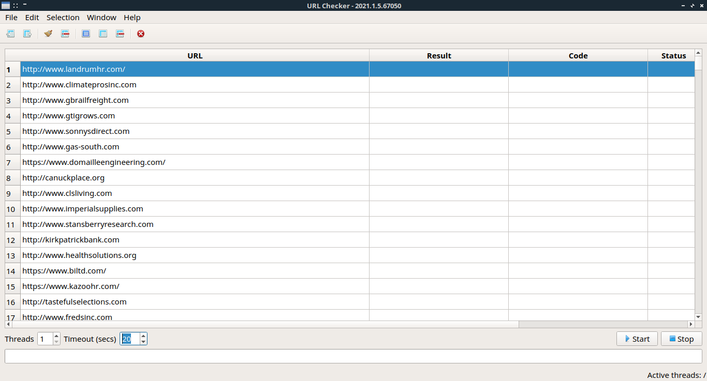

# URL Checker


### Screenshot




### About

C++ Qt5 multithreaded application for checking http response status of urls. Ported from previous old "Site Alive Checker" PyQt application.


### Requirements

You need C++ 11 compiler, Qt5 and CMake 2.8.11 or higher.


### Build instructions

```
cd /your/project/build
cmake ../
make

./urlchecker
```
