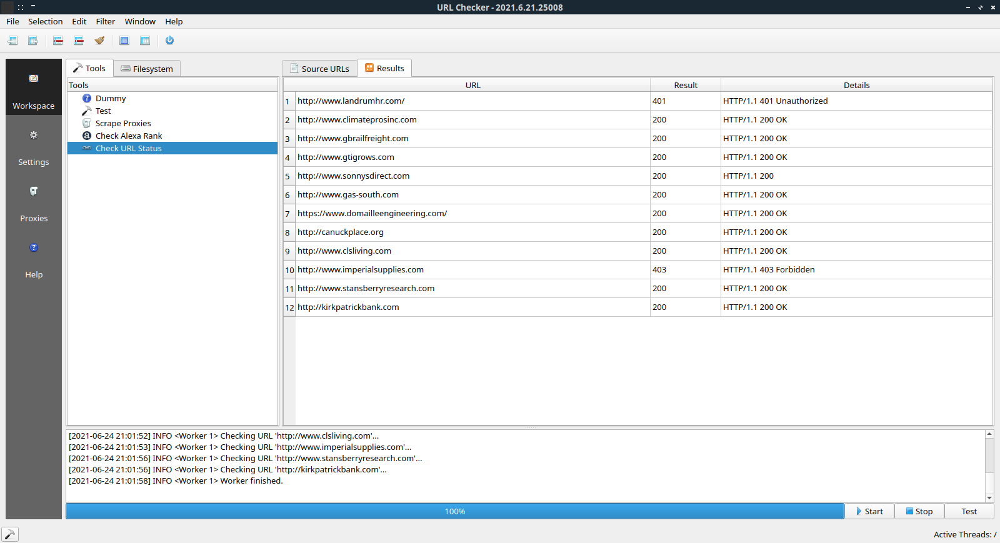

# URL Checker


### About

C++ Qt5 multi-threaded application for checking HTTP response status of urls (**Work in progress**).

### Screenshot




### Requirements

- C++ compiler (>=C++17)
- CMake (>=3.15)

Libraries/frameworks:
- [Qt](https://github.com/qt/qt5) (>=5.11 maybe it will work with older minor releases)
- [cpr](https://github.com/whoshuu/cpr)
- [Catch2](https://github.com/catchorg/Catch2)


### Build instructions

Clone repository:
```
git clone https://github.com/fuzzy69/urlchecker.git
```

Navigate to project directory:
```
cd /urlchecker
```

Download dependencies:
```
git submodule update --init --recursive 
```

Create build directory somewhere (preferably out of project directory) and navigate into it:
```
mkdir build
cd build
```

Build project by passing the full path to a cloned urlchecker project:
```
cmake <YOUR PATH>/urlchecker
make
```

Compiled application  executable and required files are located in bin directory. Run executable with:
```
bin/urlchecker
```

Run tests with:
```
bin/tests
```
