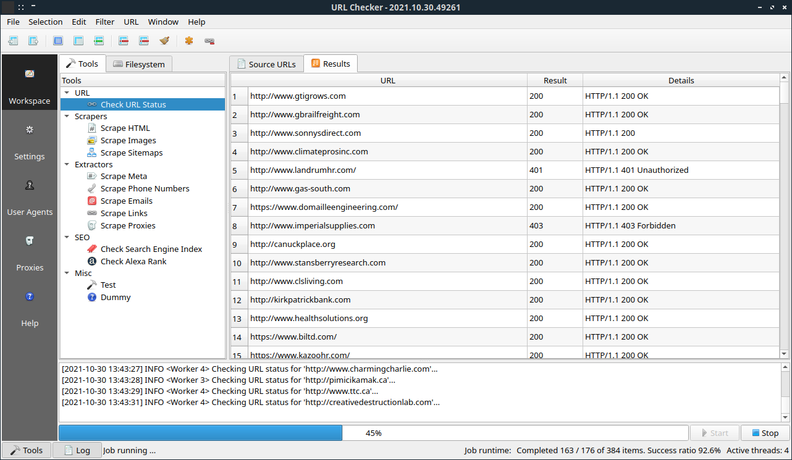

# URL Checker


### About

C++ Qt5 multi-threaded application for checking HTTP response status of urls (**Work in progress**).

### Screenshot




### Requirements

You'll need a C++ 11 compiler, Qt5 library and CMake 2.8.11 (or higher).


### Build instructions

Navigate to project directory:
```
cd /urlchecker
```
Download dependencies to libs directory:
```
cd libs/
git clone https://github.com/whoshuu/cpr.git
git clone https://github.com/effolkronium/random.git
```
Go back to project directory in order to complete the project building.
```
cd ..
```
Create a build directory and move to it:
```
mkdir build
cd build/
```
Build project.
```
cmake ../
make
```
Run executable with:
```
./urlchecker
```
